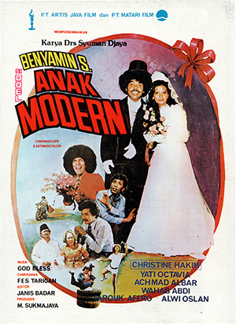

A cultural touchstone of the late 1970s. The performance secured a second Citra Award for Best Leading Actor, cementing a reputation as a master of both cultural comedy and socially resonant storytelling.

---

## Production Context

Filmed during the height of the 1970s Indonesian cinema boom, *Si Doel Anak Modern* represents a critical intersection of traditional Betawi culture and encroaching urban modernity. Directed by Sjumandjaja, the project was designed as a direct critique of Jakarta's rapid industrialization.

> "The city changes, but the roots remain stubborn. Modernity is not merely machinery; it is the collision of the village with the concrete."  
> — *Archival Interview Fragment, 1978*

### Thematic Elements

The narrative structure relies heavily on the juxtaposition of the rural and the urban. Key themes explored throughout the celluloid include:

1. **Cultural Displacement:** The struggle of indigenous populations navigating a rapidly shifting economic landscape.
2. **Satirical Materialism:** The comedic yet tragic pursuit of westernized status symbols, heavily focused on automotive culture.
3. **Linguistic Preservation:** Extensive use of Betawi dialects in mainstream cinema, establishing a precedent for regional representation.

## Archival Data

The following table details the primary production records maintained in the central dossier:

| Specification | Details |
| :--- | :--- |
| **Release Year** | 1977 |
| **Director** | Sjumandjaja |
| **Production House** | Matari Artisan |
| **Duration** | 102 Minutes |
| **Format** | 35mm Celluloid |

### Critical Reception

Initial screenings provoked strong reactions across different societal strata. Urban audiences found the comedic timing unparalleled, while cultural critics noted the underlying socio-political commentary regarding Jakarta's gentrification. 

The achievement was officially recognized at the 1977 Indonesian Film Festival. The lead performance was awarded the **Citra Award for Best Leading Actor**, marking a significant milestone in elevating comedic acting to dramatic prestige.
